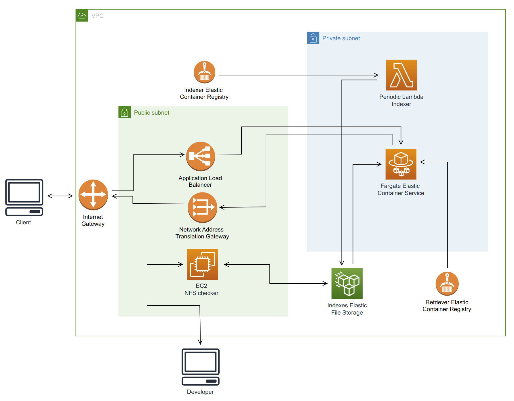

# **End-to-end lightning search** 

## Architecture overview:

The system architecture is shown above. **Note**: a search engine is clearly usually an internal tool, hookup to some frontend component through an API call.  The architecture  describe above  is not directly a production setup, since there is usually no internet gateway to search via. This has been configured for demonstration purposes 

## Repo Structure
`app/` contains relevant docker files
`iac/` Infrastructure as code using terraform and AWS.

# # Workflow order
1) Initialise backend for terraform store (AWS) s3) via the shell script
`./utils/create-s3-tf-backend-bucket.sh`
2) Let terraform connect to the s3 backend:
`cd iac && terraform init`
3) Let terraform produce a plan for the infrastructure
`terraform plan`
4) Apply the iac plan with:
`terraform apply`
5) Clean up terraform's infra:
`terraform destroy`
6) Clean up state store for terraform:
`./utils/delete-s3-tf-backend-bucket.sh`

## Workload to do:
**NOT IN ORDER OF IMPORTANCE**
- factor out secrets for dockerfiles (enviornment should be determined via terrafrom environment. Currently inside of dockerfile not linked to terrafrom var.env. 
- dynamically create ecr repo string inside `/iac/ecs/variables.tf`
- remove sample data from dockerfile.indexerLambda. Fetch data instead at runtime 
- Create TSL certificates for https and use for ALB listener `iac/alb/main.tf`
- Configure pushing to ecr to occur after ifra deployment. Very slow using `app/push-to-ecr.sh` during `terraform apply`. Should be part of different pipeline. Only during the initial infra deployment should the images be pushed. Right now, building performed locally and requires aws account details within `.aws/credentials` to be present
- `app/indexer.py` should use chunking when loading data into memory. Currenlty loads entire dataset to be indexed.
